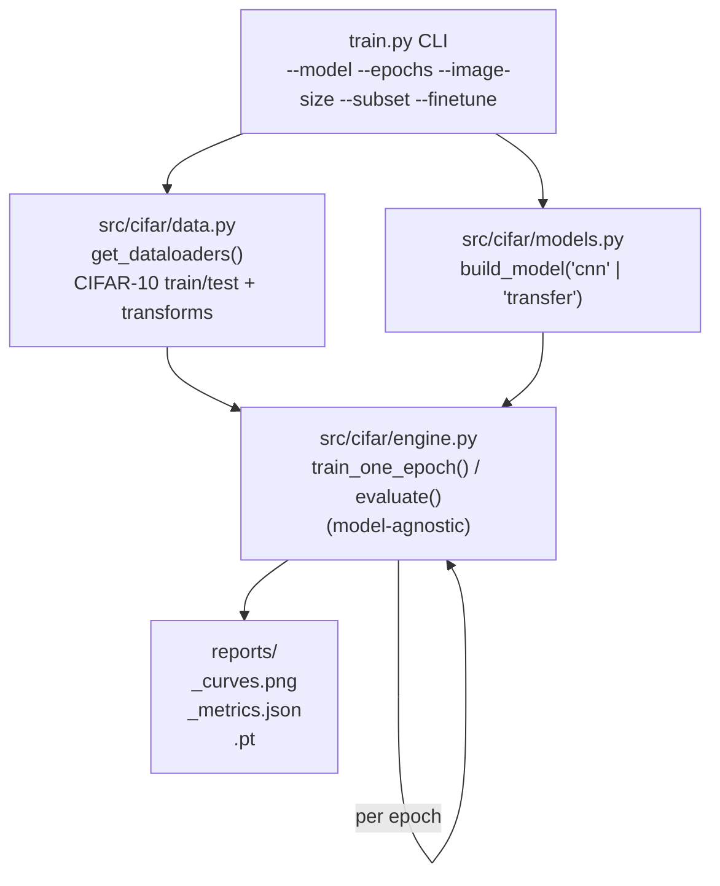

# CIFAR-10 in PyTorch — From-Scratch CNN vs Transfer Learning

Two CIFAR-10 classifiers, one shared engine: a from-scratch CNN vs a fine-tunable ResNet-18, trained and evaluated the same way so the comparison is apples-to-apples.


> **AI Engineer Roadmap — Project 2.2**
> *Teaches: PyTorch, CNNs, transfer learning, GPU training, overfitting control.*
> *Done when: your transfer-learning model beats your from-scratch one and you know exactly why.*

## What it does

Trains and compares two image classifiers on CIFAR-10:

1. **`SmallCNN`** — a compact VGG-style CNN (three conv blocks, batch norm, dropout) trained from scratch on native 32×32 images.
2. **`transfer`** — a ResNet-18 pretrained on ImageNet, with a fresh 10-class head, run either with a frozen backbone (train the head only) or fine-tuned end-to-end (`--finetune`).

Both models are trained by the same `train_one_epoch` / `evaluate` functions and see the same augmentation pipeline, so nothing about the comparison is rigged in either direction.

## Architecture



Design notes:

- **The engine is model-agnostic.** The same `train_one_epoch` trains both models — so nothing about the comparison is rigged.
- **The optimizer only sees trainable parameters** (`[p for p in model.parameters() if p.requires_grad]`), so a frozen backbone genuinely trains just the head.
- **`image_size` flows from the CLI through the transforms**, letting 32px CIFAR feed a 224px-expecting ImageNet model via on-the-fly resize.
- **A cosine LR schedule** anneals the learning rate over training.

### Why transfer learning wins

The ResNet-18 backbone arrives already knowing how to see. Trained on ImageNet's ~1.2M images, its early layers have learned general visual primitives — edges, textures, colour blobs, simple shapes — that are equally useful for CIFAR:

- With a **frozen backbone**, only a tiny linear head (~5K params) trains on top of those ready-made features, reaching high accuracy in a handful of epochs because it isn't relearning vision from scratch.
- The **from-scratch CNN** must discover all of that structure from CIFAR's 50K images alone, which takes far more epochs and tops out lower.
- **Fine-tuning** (`--finetune`, unfreezing the backbone) then nudges those general features to be CIFAR-specific, squeezing out the last few points.

### Overfitting control

Three standard tools are built in, because a CNN with millions of parameters will memorise 50K images otherwise:

- **Data augmentation** (`RandomCrop(padding=4)` + `RandomHorizontalFlip`), applied to **training data only** — the test set is never augmented, or the metrics become noisy and non-comparable.
- **Batch normalisation** after every conv layer.
- **Dropout (0.5)** in the classifier head.

Watch the train-vs-test curves in `reports/<model>_curves.png`: a widening gap is overfitting.

## Quickstart

```bash
python -m venv .venv && source .venv/bin/activate   # Windows: .\.venv\Scripts\activate
pip install -e ".[dev]"

# Fast CPU smoke test (proves the loop runs; no GPU needed):
python train.py --model cnn --epochs 1 --subset 2000

# Full runs (use a GPU — these are slow on CPU):
python train.py --model cnn --epochs 30                       # from scratch
python train.py --model transfer --image-size 224 --epochs 10 # transfer learning (frozen)
python train.py --model transfer --finetune --epochs 10        # transfer learning (fine-tuned)

# 13 tests, fully offline (random tensors + torchvision FakeData, no CIFAR download):
pytest -q
```

`train.py` downloads CIFAR-10 (~170 MB) from the torchvision mirror (`cs.toronto.edu`) on
first run. The test suite never touches the network — it exercises the real models,
transforms, optimizer, and training loop against synthetic data
(`torchvision.datasets.FakeData`) and `pretrained=False` weights. If the mirror is
slow/unreachable, point `--data` at a local copy or run on a machine with network access.

The expected ordering when run to completion on a GPU (exact numbers depend on hardware and
epoch budget — these are *not* numbers reproduced in this repo, just the well-known,
reproducible ordering the exercise is built to demonstrate):

| Model | Trainable params | Typical epochs | Typical test acc |
| --- | ---: | --- | ---: |
| `SmallCNN` from scratch | ~1.6M | ~30 | ~88–90% |
| ResNet-18 transfer (frozen) | ~5K (head only) | ~5 | ~91–93% |
| ResNet-18 fine-tuned (`--finetune`) | ~11M | ~10 | ~95%+ |

## Project structure

```
src/cifar/
├── __init__.py   # re-exports the public API
├── data.py       # CIFAR-10 loaders; train-time augmentation, eval-time clean transforms
├── models.py     # SmallCNN + ResNet-18 transfer model (freeze / fine-tune)
└── engine.py     # model-agnostic train_one_epoch / evaluate / fit (checkpoints the
                  # best-test-accuracy epoch, not just the final one) / device selection
train.py          # CLI: choose model, epochs, image size, subset; saves curves + metrics
tests/
├── test_cifar.py    # 10 offline tests (model shapes, freezing logic, transforms, training
│                     # step, best-epoch checkpoint selection)
└── test_train_cli.py # 3 offline tests for the train.py CLI (arg wiring, output files,
                       # --no-download / --no-pretrained regression)
```

## Key design decisions

- **Shared engine, not per-model training loops** — the entire point of the exercise is a
  fair comparison, so `train_one_epoch`/`evaluate` know nothing about which model they're
  training.
- **`requires_grad` filtering, not a separate "frozen mode" code path** — freezing is
  expressed once, at model-construction time (`models.py`), and the optimizer/engine simply
  respect whatever `requires_grad` says.
- **The checkpoint tracks the best epoch, not the last one** — `engine.fit()` deep-copies
  `model.state_dict()` whenever test accuracy improves, so `reports/<model>.pt` is always the
  weights that earned `best_test_acc` (also recorded as `best_epoch` in the metrics JSON),
  even if accuracy peaked mid-training and regressed afterwards.
- **Offline-first tests** — `pretrained=False` and `torchvision.datasets.FakeData` let the
  test suite validate real forward/backward passes and shape logic without a network call,
  so `pytest` is fast and reliable in any environment (including CI, once added — see
  Limitations).

## Limitations

- No committed benchmark artifacts (curves/metrics) from an actual training run — the
  accuracy table above is the well-known expected ordering, not a result reproduced in this
  repo, since a full run needs a GPU.
- No CI — the offline test suite exists but isn't run automatically on push/PR.
- `num_workers=0` is hardcoded in the data loaders; no CLI flag to raise it for
  faster real (non-smoke-test) GPU training.

## Roadmap

- [ ] Add a GitHub Actions workflow to run `pytest -q` on every push/PR.
- [ ] Add a `--num-workers` flag for real training runs.
- [ ] Commit one real `reports/cnn_curves.png` run so overfitting-control claims have a
      backing artifact.

## License

MIT. CIFAR-10 is a public research dataset (Krizhevsky, 2009).
